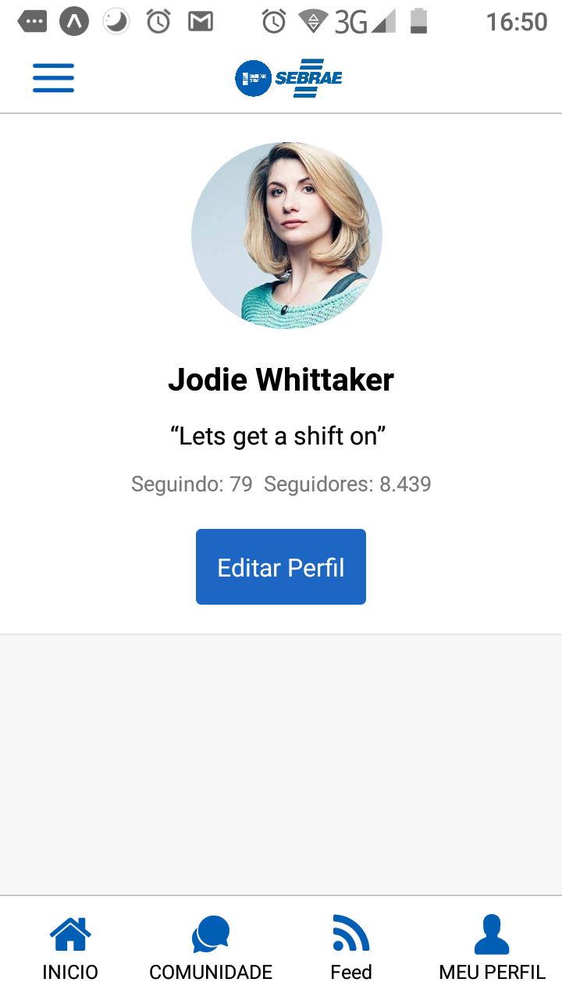

<h4 align="center">
  Sebrae Community
</h4>

<h1 align="center">
  
</h1>

A social media project for share entrepreneur knowledge for a hackathon organized by @shawee-io
<p align="center">
  
</p>



## Installation

Use that code
```git clone https://github.com/craftsmaker/mega-hack-2.git```
Go in the frontend folder and use these commands
```
yarn install
yarn start
```
or
```
npm i
npm start
```

## License
[MIT](LICENSE)
